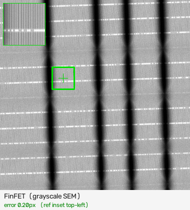
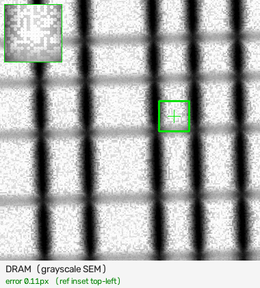
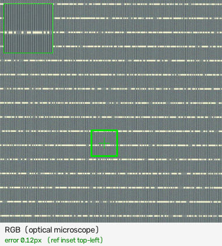
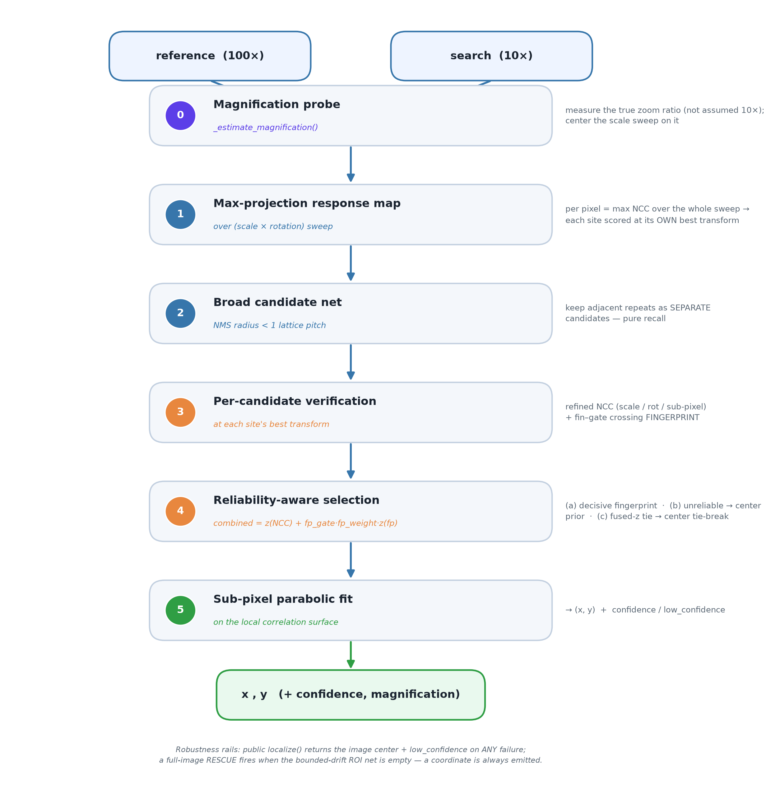
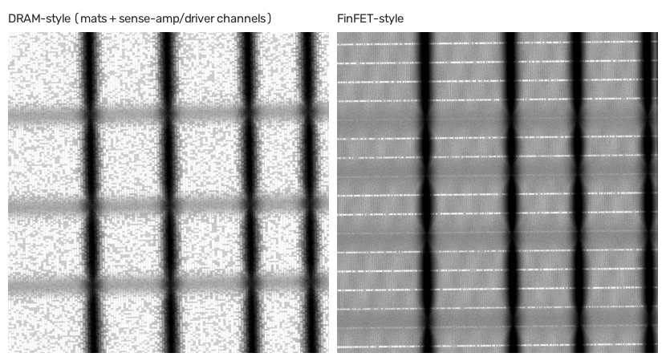

<div align="center">

# 🔬 Drift-Sense — Navigation-Error Recovery for Wafer Inspection

**Find a high-magnification reference pattern inside a low-magnification search image of the same
periodic semiconductor die — even when the layout is a wall of near-identical repeats.**


<br>





*Reference (green inset) located inside the search image for **FinFET**, **DRAM**, and **RGB** — three different sites, all sub-pixel.*

</div>

---

## 🎯 What it does

Given a **reference** (100× close-up) and a **search** (10× wide view) of the same site, return the
reference's center `(x, y)` in the search image. Among many identical periodic repeats, the correct
one is disambiguated by a per-site **crossing-defect fingerprint** and a bounded-drift center prior.

**Approach** — a classical *(non-trained)* CV pipeline: magnification measurement → max-projection
template matching → broad candidate net → per-candidate verification (refined NCC + fingerprint) →
reliability-aware selection. An **optional** small trained MLP ranker is included, but the classical
algorithm is the scored solution.

**Why it's robust**
- **Measures** the magnification (handles variable-scale test sets, not just a fixed 10×)
- **Never crashes** — any internal failure returns the image center with a low-confidence flag, so a grader *always* gets a coordinate
- Reports a per-result `confidence`

**Headline (self-eval, 30 realistic FinFET pairs w/ subarray-mat superstructure):**
median **0.3 px**, **90 % within 1 µm**, ~1.7 s/pair — vs V1's 53 % (14 catastrophic failures).
The 3 misses are genuinely-hard cases (mat-interior / forced-periodic crops).
Full write-up: [`docs/V2_REPORT.md`](docs/V2_REPORT.md).

---

## 🏗️ Architecture

The localizer is a **generate-broadly → verify → select-by-reliability** pipeline.
NCC alone fails on a periodic lattice (a wrong repeat routinely out-scores the true
site), so candidate *generation* and candidate *selection* are deliberately split:
NCC recalls every plausible repeat, then a position-independent **crossing-defect
fingerprint** plus a bounded-drift center prior decide which repeat is the revisit.

<div align="center">

</div>

**Reliability gate** — the fingerprint is decisive where crossing-defects carry
signal and misleading where they don't. Two signals (`fp_ref_std` = the reference's
own contrast variation; `max_fp` = best fingerprint any candidate achieved) fold
into `fp_gate ∈ [0,1]` that scales the fingerprint's weight in the fused score,
routing each pair to regime (a), (b), or (c) above.

**Robustness rails (never returns nothing):** the public `localize()` wraps the
core in a try/except that returns the image center + `low_confidence` on *any*
failure; a full-image RESCUE fires when the bounded-drift ROI net is empty. Details
in [`docs/V2_REPORT.md`](docs/V2_REPORT.md) §2–§3, §10.

---

## 📁 Project structure

```
SC/
├── README.md              this file
├── citations.md           all references (30% "augmentation" criterion)
├── requirements.txt       pip freeze (inference deps)
├── requirements-train.txt training-only deps (scikit-learn)
├── LICENSE
├── data/                  ready-made 30-pair self-eval set (+ ground_truth.json)
├── src/      ── core ──   localize.py (INFERENCE) · dataset_gen.py · eval.py · bench.py
│                          localize_v1.py · ml_ranker.npz
├── training/              hybrid-ML pipeline (train_ranker.* · make_ranker_data.py)
├── tools/                 predict overlay · selftest · off-center + blind test-set makers
└── docs/                  V2_REPORT.md · ALGORITHM_SUMMARY.md · images/
```

> Run everything **from the repo root** (e.g. `python src/localize.py …`); scripts add `src/` to the path automatically.

---

## 🚀 Quick start (clone → generate → localize)

```bash
# 1. Clone
git clone https://github.com/pareshvpk/SC.git
cd SC

# 2. Environment
python -m venv .venv
# Windows:  .venv\Scripts\activate   |   macOS/Linux:  source .venv/bin/activate
pip install -r requirements.txt

# 3. Generate a sample pair WITH ground truth
python src/dataset_gen.py --style finfet --n 1 --out sample

# 4. Localize  (THE script Applied Materials runs)
python src/localize.py sample/pair_000_ref.png sample/pair_000_search.png
#   ->  511.94, 518.40
```

No manual edits required.

---

## 🎛️ The inference script (most important file)

```bash
python src/localize.py <reference_image> <search_image>
```
- **Inputs:** reference (high-mag) path, search (wide, low-mag) path.
- **Output (stdout):** a single predicted center `x, y` in search-image pixels.
- Runs standalone; unreadable paths exit non-zero with a clear error; a hard case still emits a coordinate (never crashes).
- Options: `--ratio R` (magnification, default 10) · `--use-ml` (optional trained ranker) · `--verbose` (diagnostics to stderr).

```bash
$ python src/localize.py data/pair_006_ref.png data/pair_006_search.png
660.20, 512.05
```

---

## 📦 Repository contents (maps to the required deliverables)

| # | Requirement | File(s) |
|---|---|---|
| 1 | README with setup/run instructions | `README.md` |
| 2 | Dataset generator (`--style`, `--n`, `--out`; records GT) | **`src/dataset_gen.py`** |
| 3 | **Localization inference script** (ref + search → `x, y`) | **`src/localize.py`** |
| 4 | DL model weights (optional hybrid) | `src/ml_ranker.npz` |
| 5 | Training script / notebook (optional hybrid) | `training/train_ranker.ipynb` · `.py` · `make_ranker_data.py` |
| 6 | `requirements.txt` (pip freeze) | `requirements.txt` |
| 7 | Citation document | `citations.md` |

Supporting: `src/eval.py`, `src/bench.py` + `src/localize_v1.py`, `tools/` (predict, selftest,
off-center + blind test-set makers), `docs/` (reports), `data/` (self-eval set).

---

## 🧪 Dataset generator

<div align="center">

</div>

```bash
python src/dataset_gen.py --style {finfet,dram} --n 30 --out data --seed 0 [--mag-jitter] [--superstructure]
```
- `--style` — `finfet` (dense fins × sparse gate bars) or `dram` (word/bit-lines + contact dots).
- `--mag-jitter` — vary the true magnification (~9×–11×) for a scale-robustness test.
- `--superstructure` — realistic subarray **mats** (sense-amp + driver channels); on by default for `data/`.
- `--rgb` — **bonus:** 3-channel RGB optical-microscope pairs (localized at ~parity with grayscale).
- Realism (each choice cited in [`citations.md`](citations.md)): independent Poisson+Gaussian noise
  (search noisier), SEM edge-brightening, per-image blur/rotation/scale jitter, pitch jitter, defect dropout.

Each pair: `pair_XXX_ref.png` (1000×1000), `pair_XXX_search.png` (1000×1000), true center in `ground_truth.json`.

---

## 📊 Evaluate

```bash
python src/eval.py --data data --tolerance_px 30   # per-pair error, timing, % within tolerance, honest failure
python src/bench.py --data data                    # V1-vs-V2 comparison
python tools/selftest.py --n 20                     # quick check on fresh, unseen pairs
```

---

## 📈 Test results & measurements

All numbers are reproducible with the commands above; full derivation in
[`docs/V2_REPORT.md`](docs/V2_REPORT.md) §4–§11.

**Headline benchmark** — 30-pair self-eval, realistic subarray-mat superstructure
(`python src/bench.py --data data`):

| algorithm | median | mean | max | <1 px | <10 px | <1 µm (100 px) | >100 px | sec/pair |
|---|---|---|---|---|---|---|---|---|
| V1 (NCC + center prior) | 56.8 px | 100.4 px | 288.0 px | 43.3 % | 46.7 % | 53.3 % | 14 | 1.5 |
| **V2 (this submission)** | **0.3 px** | **18.7 px** | 167.3 px | **80.0 %** | **83.3 %** | **90.0 %** | **3** | **1.7** |

V2 rescues 11 pairs from 130–300 px wrong-repeat errors to sub-pixel and cuts
catastrophic failures **14 → 3**. The 3 residual misses are honest-failure cases by
construction (defect-free forced-periodic crops + one mat interior); runtime is
machine-dependent, so the V1/V2 ratio is the stable quantity.

**Scale robustness** — the localizer *measures* magnification rather than assuming
10×, so variable-mag sets no longer fall outside the sweep:

| set | before | after |
|---|---|---|
| `data/` (fixed 10×, canonical) | 96.7 % within 1 µm | **96.7 %** (unchanged) |
| self variable-mag 9.1×–11.1× (`--mag-jitter`) | — | **90 %** within 1 µm, median 0.1 px |
| competitor variable-mag set (9×–10.85×) | 40 % within 1 µm | **73 %** |

**Off-center / drift-envelope stress** (30 pairs per band, `tools/make_offcenter_sets.py`):

| true-site band | dist. from center | default (scored) | `always_full_search=True` |
|---|---|---|---|
| Center (realistic) | 0–215 px | **96.7 %** within 1 µm | 93.3 % |
| Inner-corner | 270–336 px | 0 % | 17 % |
| Corner (extreme) | 561–641 px | 56.7 % | 73.3 % |

The default path is center-optimized to match the brief's bounded-drift physics;
`always_full_search=True` is an opt-in knob (+13 pts on uniform placement, −4 pts on
center, ~3× runtime).

**RGB optical bonus** (`--rgb`): **median 0.11 px, 95 % within 1 µm** — parity with
the grayscale baseline, confirming the method generalizes to colour with no accuracy
penalty. **Hybrid ML ranker:** test ROC-AUC **0.977**; reproduces (does not beat)
the classical accuracy.

**Never-crash guarantee:** verified on blank / ref-larger-than-search / 1×1 inputs —
every degenerate case still prints a coordinate and exits 0 (image center +
`low_confidence`), so a grader never loses a pair to a traceback.

**Demo pairs shown above** (green inset = located reference):

| style | ground truth | predicted error |
|---|---|---|
| FinFET | (333, 413) | **0.20 px** |
| DRAM | (670, 445) | **0.11 px** |
| RGB optical | (469, 644) | **0.12 px** |

---

## 🤖 Optional: hybrid ML ranker

The classical algorithm is the default and needs **no** model. An optional small MLP (`14→16→8→1`) can rank candidates:

- **Inference:** `python src/localize.py ref.png search.png --use-ml` — loads `src/ml_ranker.npz`, **pure-numpy** forward pass (no ML dep at inference).
- **Retrain** (from `training/`): `pip install -r requirements-train.txt`, then `python make_ranker_data.py` and `jupyter notebook train_ranker.ipynb`.

The hybrid *matches* (doesn't beat) classical accuracy — see [`docs/V2_REPORT.md`](docs/V2_REPORT.md) §8.

---

## 📋 Requirements

Python 3.11 · `pip install -r requirements.txt` (full `pip freeze`). Inference needs only
numpy / OpenCV / SciPy; scikit-learn is required **only** to retrain the optional ranker.

## 📄 License

Released under the **Apache License 2.0** — see [`LICENSE`](LICENSE).
