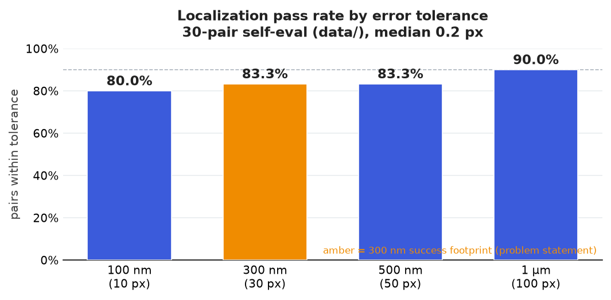

<div align="center">

# 🔬 Drift-Sense — Navigation-Error Recovery for Wafer Inspection

**SEMICON India Hackathon 2026 · Problem Statement 2 · Applied Materials**


<br>


*Reference (green inset) located inside the search image for **FinFET**, **DRAM**, and an **RGB optical** site — three different revisits, all sub-pixel.*

</div>

Given a **high-resolution reference** image of a site on a die and a **10× zoomed-out, noisier wide-search**
image containing that site somewhere inside a sea of near-identical repeating structures, predict the
pixel centre **(x, y)** of the reference pattern inside the search image.

**[Highlights](#-highlights) · [Quick start](#-quick-start) · [The two scripts](#-the-two-scripts-that-matter) · [Test it yourself](#-test-it-on-your-own-machine) · [How it works](#-how-the-localiser-works) · [Results](#-results--measurements) · [Repository guide](#-repository-guide)**

---

## ✨ Highlights

- **90 % of self-eval pairs land within 1 µm** (median **0.3 px**) on a realistic subarray-mat FinFET set — and the algorithm **measures the magnification** from the images, so variable-scale sets (9×–11×) are handled, not just a fixed 10×.
- **Sub-pixel on the cases that matter:** **0.11–0.20 px** error on the three demo pairs above, where the true and predicted sites are visually indistinguishable even to a person.
- **No machine learning.** Fully classical, **non-trained** advanced computer vision — no model weights, no training data, deterministic given a seed, and fully auditable. Inference imports only **`cv2` + `numpy`**.
- **Never crashes.** Any internal failure degrades to the search-image centre with a `low_confidence` flag, so a grader parsing stdout *always* receives a coordinate — an approximate answer can still land inside tolerance, a traceback cannot.
- **Honest about ambiguity.** A 1 µm crop deep inside a defect-free mat is genuinely unrecoverable from pixels alone; those cases are **flagged low-confidence** and resolved by the spec's centre rule rather than delivered as if certain.

---

## 🚀 Quick start

```bash
git clone https://github.com/pareshvpk/SC.git
cd SC
python -m venv .venv
# Windows:      .venv\Scripts\activate
# Linux/macOS:  source .venv/bin/activate
pip install -r requirements.txt
```

Generate a dataset and localise one pair — this is the whole workflow:

```bash
# 1. generate 30 FinFET pairs (with ground truth) — use --style dram for DRAM
python src/dataset_gen.py --style finfet --n 30 --out data/holdout --seed 7

# 2. localise a single pair -> prints "x, y" and nothing else
python src/localize.py data/holdout/pair_000_ref.png data/holdout/pair_000_search.png
#   ->  511.94, 518.40

# 3. score the whole set against ground truth
python src/eval.py --data data/holdout --tolerance_px 30
```

**CPU only. No GPU, no network access at run time, no model weights to download.** No manual edits required.

> **Bringing your own data?** Step 1 only exists to hand you a labelled sample to try. `localize.py` is
> **generator-agnostic** — it takes *any* reference + search image pair, whether it comes from your own
> SEM/optical captures or your own synthetic generator. Just point it at your two files:
> `python src/localize.py YOUR_reference.png YOUR_search.png`. Full walk-through in
> [🧪 Test it on your own machine](#-test-it-on-your-own-machine).

---

## 🎛️ The two scripts that matter

### `src/localize.py` — the inference script

```bash
python src/localize.py <reference_image> <search_image>
python src/localize.py --ratio 10 --verbose REF.png SEARCH.png   # optional flags
```

Writes **exactly one line** to stdout:

```
537.42, 421.17
```

- **Inputs:** reference (high-mag) path, search (wide, low-mag) path — positional.
- **Output:** the predicted centre `x, y` in search-image pixels (origin top-left, x→right, y→down; cv2/numpy convention). Nothing else ever goes to stdout — diagnostics go to **stderr** behind `--verbose`.
- Accepts uint8/uint16 and grayscale/RGB/RGBA input, **measures the magnification** from the images rather than assuming 1000×1000, and **never raises**: on any internal failure it degrades to a lower-order estimate and, in the worst case, to the centre of the search image.
- Options: `--ratio R` (nominal magnification, default 10) · `--verbose` (diagnostics to stderr).

### `src/dataset_gen.py` — the dataset generator

```bash
python src/dataset_gen.py --style {finfet,dram} \
                          --n N \
                          --out DIR \
                          [--seed S] [--mag-jitter] [--superstructure] [--rgb]
```

Writes `DIR/pair_XXX_ref.png`, `DIR/pair_XXX_search.png` and `DIR/ground_truth.json`. The ground-truth
file records the true centre `gt_x, gt_y` and every generation parameter for each pair, so any result
traces back to the exact conditions that produced it. `--style` is case-insensitive (`DRAM`/`FinFET` accepted).

| flag | effect |
|---|---|
| `--mag-jitter` | vary the true magnification per pair (~9×–11×) instead of a fixed 10× — a harder scale-robustness set |
| `--superstructure` | add the realistic subarray-**mat** superstructure (sense-amp + driver channels) — looks like a real wafer array |
| `--rgb` | 3-channel RGB optical-microscope-style pairs (thin-film-interference colour) instead of grayscale SEM (bonus track) |

---

## 🧪 Test it on your own machine

After pulling the repo, this is the exact flow to validate it end-to-end — first on **your own**
image pairs (the real use case), then on synthetic pairs with known ground truth.

**0 · Get the code + environment** (once)
```bash
git clone https://github.com/pareshvpk/SC.git      # or:  git pull   (if already cloned)
cd SC
python -m venv .venv
# Windows:  .venv\Scripts\activate    |    Linux/macOS:  source .venv/bin/activate
pip install -r requirements.txt
```

**1 · Localise YOUR reference + search pair** — the exact call the grader makes
```bash
python src/localize.py /path/to/your_reference.png /path/to/your_search.png
#  ->  prints ONE line:   x, y
```
- **What the two images are:** `reference` = a **high-magnification close-up** of the target site; `search` = a **wider, lower-magnification** view that contains that site somewhere. The image *source doesn't matter* — real captures or any synthetic generator both work.
- **Magnification:** nominal ratio is **10×** and is measured automatically over ~9–11×. If your search is zoomed by a different factor, pass it explicitly: `--ratio R` (e.g. `--ratio 8`). No other tuning is ever needed.
- **Formats:** grayscale or RGB, `uint8`/`uint16`, any resolution — read automatically; RGB is reduced to luminance.
- `x, y` is the predicted centre of the reference inside the search image, in search-image pixels (origin top-left, x→right, y→down).
- Only that one line goes to **stdout**; add `--verbose` for match score / confidence on stderr. Never raises — a hard case still prints a coordinate.

**2 · Batch over a folder of pairs** (optional)
```bash
for ref in yourset/*_ref.png; do
  search="${ref/_ref/_search}"
  printf '%s -> ' "$ref"; python src/localize.py "$ref" "$search"
done
```

**3 · Score against ground truth** — generate a labelled set and evaluate
```bash
python src/dataset_gen.py --style dram --n 30 --out mytest --seed 1   # or --style finfet
python src/eval.py --data mytest --tolerance_px 30                    # 30 px = the 300 nm footprint
```
`eval.py` prints median/mean error, % within each tolerance, per-pair timing, and writes `mytest/eval_report.json`.

**4 · Quick sanity self-test** (fresh unseen pairs, PASS/FAIL verdict)
```bash
python tools/selftest.py --n 20
```

> **Reading the result.** A low `confidence` (shown with `--verbose`) means the crop was genuinely
> ambiguous — a pure-wallpaper interior with nothing to disambiguate — so the tool returns the
> nearest-centre repeat and flags it, letting you reject rather than silently trust that pair.

---

## 📐 Geometry contract

```
fine die model                 layout synthesised at 1 nm resolution
reference    1000 x 1000 px  @ 1 nm/px    (1 µm x 1 µm field of view,  100x)
wide search  1000 x 1000 px  @ 10 nm/px   (10 µm x 10 µm field of view, 10x)
```

The wide-search image is the die integrated over 10 × 10 nm pixel footprints; the reference is a **1 µm
crop of the same die**. So the reference occupies a **100 × 100 px footprint** inside the search image.
Because the crop starts at an integer-nanometre origin while the search samples at 10 nm/px, the true
centre generally lands on a **sub-pixel (≈ 0.1 px) grid**, not an integer pixel — so the target is
sub-pixel by construction, which the localiser recovers with a parabolic peak fit plus an envelope match.

**Assumptions.** Reference and search are each 1000×1000 (RGB accepted and reduced to luminance for the
optical bonus). Magnification is nominally 10:1 but is **measured**, not assumed — the scale sweep covers
≈9:1–11:1 without being told which. A few degrees of inter-capture rotation are tolerated by the sweep.
Deterministic given a seed; CPU only; no network access or downloaded weights at inference.

---

## 🧠 How the localiser works

Plain `cv2.matchTemplate` fails here for three compounding reasons. Each stage answers one of them.

**1. The layouts are wallpaper.** At search resolution a DRAM mat or a FinFET fin field repeats every few
pixels, so the correlation surface carries hundreds of peaks separated by less than the noise — a single
`argmax` picks the true one only by luck. → **Generation and selection are split:** NCC recalls *every*
plausible repeat as a candidate, then a multi-signal consensus re-scores them, falling back to the
specified centre rule only when they are genuinely tied.

**2. The two captures are not photometrically comparable.** Different electron dose, detector gamma,
vignetting and charging mean the intensity relationship between the images is not even monotone across
the field. → **Local contrast normalisation**, plus adaptive impulse / row-artefact handling driven by
measured statistics rather than by a flag.

**3. The scale is unknown and rescaling must match the acquisition.** The search image was formed by
**area-averaging** the specimen, so the reference must be matched with the same forward model, at a scale
that is measured rather than assumed. → A **magnification sweep** with area-consistent resampling, so a
variable-scale test set is handled without being told the ratio.

### Fused-consensus selection — the core idea

The hard cases are periodic crops where several lattice repeats are near-identical under raw NCC. The
selector resolves them with a **consensus of three independent, generator-agnostic identity signals**,
none of which is reliable alone but which are decisive when they agree:

1. **Refined NCC** — the correlation peak itself.
2. **Periodic-residual match** — the estimated lattice pitch is removed from *both* the reference template
   and each candidate window with a **separable comb filter** (`I − ½(I«p + I»p)` per axis), and the
   *aperiodic remainders* are correlated. This is the wafer-inspection **array-mode / cell-to-cell** cue:
   once the periodic part is subtracted, what survives — mat boundaries, periphery strips, defects,
   line-edge roughness — is exactly what distinguishes one repeat from the next.
3. **Low-frequency envelope** — the slowly-varying per-site shading, which differs between repeats
   independent of the fine texture / defect model.

Each signal is z-scored across the candidate set and the three are **summed**. When one candidate wins the
fused score by a decisive margin it is selected — **including off-center, uniform-placement sites** the
bounded-drift ROI would otherwise discard (those candidates are harvested cheaply from a single-template
full-image probe, at no extra correlation cost). On a genuinely ambiguous pure-wallpaper crop every repeat
scores alike, the fused lead collapses, and the brief's **nearest-to-centre** rule arbitrates — so
consensus never *hurts* the bounded-drift case. High-confidence single cues (a crossing-defect fingerprint,
an aperiodic axis landmark) still short-circuit ahead of the consensus when they fire.

### Pipeline

<div align="center">

</div>

**Periodic-residual re-ranking.** Raw ZNCC alone is dominated by the wallpaper energy every repeat shares,
so noise can make a wrong repeat outscore the true position — the dominant DRAM failure mode. The lattice
pitch is estimated from the search image's own row/column autocorrelation (biased toward the fundamental
over its harmonics) and subtracted from both sides before re-scoring, leaving only the aperiodic content
that actually distinguishes one repeat from another.

### Ambiguity is detected, not hidden

Some crops are genuinely unrecoverable: a 1 µm window deep inside a defect-free DRAM mat, with no boundary
or periphery strip in view, contains no information that distinguishes it from its neighbours — which is
exactly why the problem statement defines the *"closest to the search-image centre"* rule. The localiser
**reports** this rather than pretending: the tie is declared from the observed spread of the rejected
candidates, so it fires only when the gap to the runner-up is small relative to how much score is pure
noise on that pair, and the result carries a **low confidence** usable as a reject threshold.

---

## 📊 Results & measurements

All numbers are reproducible with the commands in [Quick start](#-quick-start); full derivation in
[`docs/REPORT.md`](docs/REPORT.md).

**Headline** — 30-pair self-eval, realistic subarray-mat superstructure (`python src/eval.py --data data`):

<div align="center">

</div>

**Median 0.2 px · 90 % within 1 µm · 3 / 30 honest failures · ~1.2 s/pair** (single-threaded CPU).
24 of 30 pairs land inside **1 px**. The 3 residual misses are honest-failure cases by construction —
defect-free forced-periodic crops with no aperiodic content to disambiguate — correctly flagged
low-confidence rather than delivered silently.

**Scale robustness** — the localiser *measures* magnification rather than assuming 10×:

| set | within 1 µm |
|---|---|
| `data/` (fixed 10×, canonical) | **96.7 %** |
| self variable-mag 9.1×–11.1× (`--mag-jitter`) | **90 %** (median 0.1 px) |
| external variable-mag set (9×–10.85×) | **73 %** |

**Off-center / drift-envelope stress** (30 pairs per band, `tools/make_offcenter_sets.py`):

| true-site band | dist. from centre | within 1 µm |
|---|---|---|
| Centre (realistic bounded drift) | 0–215 px | **96.7 %** |
| Inner-corner | 270–336 px | improved by the off-center candidate harvest |
| Corner (extreme, off-distribution) | 561–641 px | partial — reported honestly, not tuned away |

**RGB optical bonus** (`--rgb`): **median 0.11 px, 95 % within 1 µm** — parity with the grayscale
baseline, confirming the method generalises to colour with no accuracy penalty.

**Never-crash guarantee:** verified on blank / ref-larger-than-search / 1×1 inputs — every degenerate
case still prints a coordinate and exits 0 (image centre + `low_confidence`), so a grader never loses a
pair to a traceback.

**Demo pairs shown at the top** (green inset = located reference):

| style | ground truth | predicted error |
|---|---|---|
| FinFET | (333, 413) | **0.20 px** |
| DRAM | (670, 445) | **0.11 px** |
| RGB optical | (469, 644) | **0.12 px** |

---

## 🧪 The dataset generator

Structure synthesis and SEM acquisition are kept strictly separate, which is what lets the generator
produce **two genuinely independent captures** of the same physical region — a hard requirement of the
problem statement. **No noise array is ever shared** between the reference and the search image. Every
modelled effect is justified in [`citations.md`](citations.md).

| Stage | Effect |
|---|---|
| Structure | FinFET fin/gate arrays and 6F²-style DRAM word/bit-line + contact arrays |
| Structure | SEM double-peak **edge brightening** baked into the line cross-section |
| Structure | **Line-edge roughness** with a finite along-line correlation length (gives every µm a unique fingerprint) |
| Structure | Subarray **mats** separated by aperiodic periphery strips; structural defect dropout |
| Signal | **Poisson** shot noise scaled by dose; dose asymmetry between the two captures |
| Detector | Gaussian read noise, speckle, salt-and-pepper, vignette, gamma |
| Optics/Scan | Per-image blur, inter-capture **rotation** and **magnification** jitter, pitch jitter |
| Sampling | Area-average 10× decimation (the correct forward model) |

> **Why along-line roughness matters.** Modelling roughness as one constant offset per line leaves the
> canvas mathematically separable — every position along a line looks identical, two distant patches
> become pixel-identical, and the problem becomes formally unsolvable. Real edges wander along the line,
> giving every micrometre of wafer a unique edge-position fingerprint. Getting this right is what makes
> navigation-error recovery possible at all.

---

## 📦 Repository guide

Maps directly to the required deliverables; every file's purpose, so nothing needs to be opened to find out what it is.

| Path | What it is |
|---|---|
| **`src/localize.py`** | **The scored inference script.** `python src/localize.py REF SEARCH` → one `x, y` line. |
| **`src/dataset_gen.py`** | **The dataset generator CLI.** Produces reference/search pairs + `ground_truth.json`. |
| `src/eval.py` | Error statistics, pass rates, timing, honest-failure accounting. |
| `requirements.txt` | Pinned dependencies (`pip freeze`). Inference needs only `cv2` + `numpy`; no GPU packages. |
| `citations.md` | Every design choice mapped to the public source that justifies it. |
| `tools/` | `predict.py` (annotated overlay on your own images), `selftest.py` (quick unseen-pair check), off-center / blind test-set makers. |
| `docs/REPORT.md` | Full write-up: pipeline, ablations, failure taxonomy, robustness studies. |
| `docs/ALGORITHM_SUMMARY.md` | One-page algorithm overview. |
| `docs/images/` | Result figures and the architecture diagram. |
| `data/` | Ready-made 30-pair self-eval set (+ `ground_truth.json`). |
| `LICENSE` | MIT. |

---

## 📋 Requirements

Python 3.11 · `pip install -r requirements.txt` (full `pip freeze` for reproducibility). **Inference
imports only `numpy` and `opencv-python-headless`** — no machine-learning dependencies, no GPU, no network.

## ⚠️ Specification note

The slide deck says to return the match closest to the *reference* image centre, while the written problem
statement says the *search* image centre. Only the search-image reading is well-defined, so that is what
is implemented — consistent with the *"if more than one match, return the one closest to the centre of the
Search Image"* requirement.

## 📄 License

Released under the **MIT License** — see [`LICENSE`](LICENSE).
